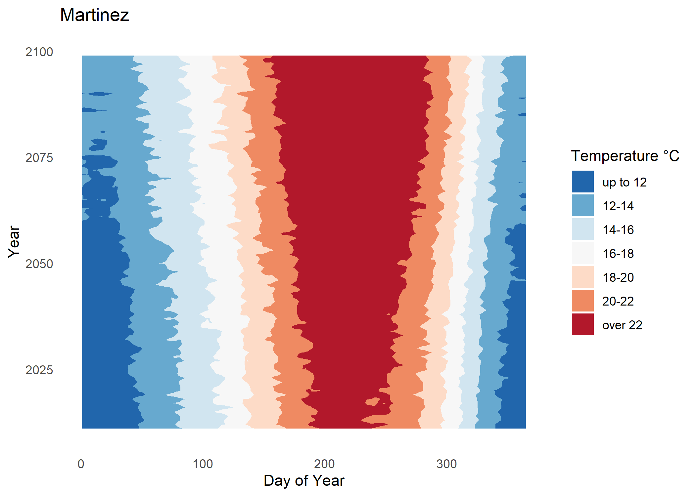

# Longfin Smelt - Climate Modeling for Future Environmental Conditions

## Overview
This repository contains data and code to support a discussion of future conditions for the Bay-Delta DPS of [Longfin Smelt (*Spirinchus thaleichthys*)](https://www.fws.gov/species/longfin-smelt-spirinchus-thaleichthys). Specifically, we used the results of a downscaled temperature and hydrology data from ten global climate change models to explore how climate change may affect the conditions necessary for spawning, rearing, and survival of Longfin Smelt. These models were run under two representative concentration pathway (RCP) trajectories. We used RCP 4.5 and RCP 8.5. The RCP 8.5 scenario represents rapid economic growth with little effort to limit or reduce emissions, reaching atmospheric greenhouse gas concentrations exceeding 900 parts per million (ppm) by 2100. The RCP 4.5 scenario represents a more moderate scenario, with atmospheric greenhouse gas concentrations increasing through mid-century, reaching a concentration of 550 ppm, followed by stabilization.

This repository contains pre-processed data that originated from the [USGS CASCaDE model](https://www.usgs.gov/mission-areas/water-resources/science/cascade-computational-assessments-scenarios-change-delta#overview) of ecoystem change for the Delta Ecosystem. The original datasets can be downloaded from the following sources:

Temperature:

Wulff, M.L., Brown, L.R., Huntsman, B.M., Knowles, N., and Wagner, W., 2021, Data used in projected air and water temperatures for selected regions of the upper San Francisco Estuary and Yolo Bypass under 20 scenarios of climate change, U.S. Geological Survey data release, <https://doi.org/10.5066/P9CXGU44>. 

Hydrology:

Knowles, N., Cronkite-Ratcliff, C., Pierce, D.W., and Cayan, D.R., 2018, Projections of Unimpaired Flows, Storage, and Managed Flows for Climate Change Scenarios in the San Francisco Bay-Delta Watershed, California: U.S. Geological Survey data release, <https://doi.org/10.5066/P9BMMUEV>. 

Graphs generated by this code appeared in Chapter 4 of the [Species Status Assessment (SSA)](https://www.fws.gov/node/4531791) for the Bay-Delta DPS of Longfin Smelt. Further development of this project may also occur.

Figure: Heat map of temperature increases over time at Martinez in Suisun Bay from 2010–2100 under the RCP 8.5 scenario.

## Installation
No installation is necessary. Code in this repository was written with R version 4.3.1 ("Beagle Scouts"). This repository is set up to work as an RStudio project; as such, file paths contained in the code are relative paths. This code will also work as a set of stand-alone R scripts, but the user may need to specify the locations of data files in a more explicity way.

## Contribute
Please contact the project maintainer for information about this repository or about collaborating on future work.

## References
USFWS. 2022. Species Status Assessment for the San Francisco Bay-Delta Distinct Population Segment of the Longfin Smelt. Available: https://www.regulations.gov/document/FWS-R8-ES-2022-0082-0003 (October 2023).

Tobias, V.D., E. Chen, J. Hobbs, M. Eakin, and S. Detwiler. 2023. Informing Extinction Risk: Summarizing Population Viability through a Meta-analysis of Multiple Long-term Monitoring Programs for a Declining Estuarine Fish Species. Biological Conservation. DOI: https://doi.org/10.1016/j.biocon.2023.110348
